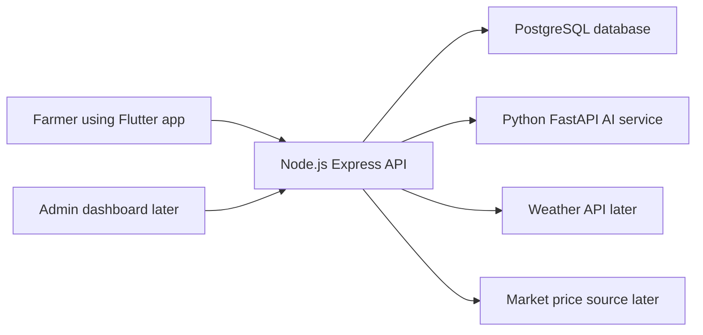
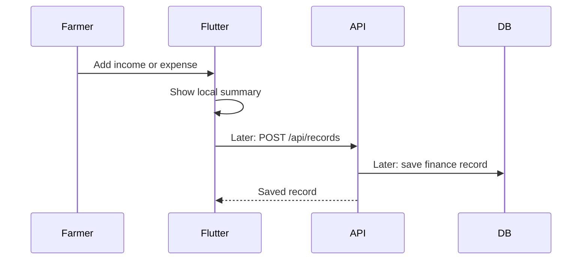

# Architecture

AgriFinance AI uses a service-based structure.

## Main parts

- Flutter app: farmer-facing interface
- Express API: business logic and REST endpoints
- PostgreSQL: persistent data storage
- FastAPI service: AI predictions and financial advice

## First implemented feature

Step 1 focuses on finance records.

For now, the Flutter app and backend both contain starter local data. In the database connection step, the API will become the single source of truth.
